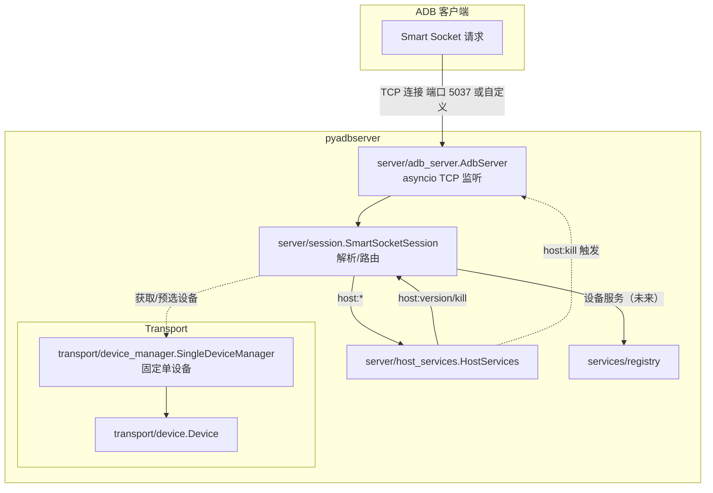

# pyadbserver
Pyadbserver is a Python implementation of ADB server. It is currently a minimal implementation of the ADB server, and still in development.

## Structure




## Quick Start
### Basic
Pyadbserver writes like a Flask app.

```python
import asyncio
from pyadbserver.server import App, AdbServer, OK

app = App()

# You need to change the version to match your adb client,
# or you will get:
# adb server version (42) doesn't match this client (41); killing...
MY_ADB_VERSION = 41

@app.route('host:version')
async def version():
    return OK(f'{MY_ADB_VERSION:04x}'.encode('ascii'))

@app.route('host:devices')
async def devices():
    return OK(b'my-fake-device\tdevice\n')

server = AdbServer(app=app, port=5000) # Specify port to avoid conflict with default port 5037

async def main():
    await server.start()
    await server.serve_forever()

asyncio.run(main())
```

```powershell
# Assume you are using PowerShell here
# Shell 1
(pyadbserver) PS E:\GithubRepos\pyadbserver> python examples/basic.py
Server started on port 5000

# Shell 2
PS C:\Users\User> $env:ANDROID_ADB_SERVER_PORT=5000
PS C:\Users\User> adb devices
List of devices attached
my-fake-device  device
```

### Class Handler
```python
import asyncio
from pyadbserver.server import App, AdbServer, route, OK

MY_ADB_VERSION = 41

app = App()

class MyDeviceService:
    def __init__(self) -> None:
        self._devices: list[tuple[str, str]] = []

    # This route is always required
    @route('host:version')
    async def version(self):
        return OK(f'{MY_ADB_VERSION:04x}'.encode('ascii'))

    @route('host:devices')
    async def devices(self):
        lines = [f'{d[0]}\t{d[1]}' for d in self._devices]
        response = '\n'.join(lines)
        if response:
            response += '\n'
        return OK(response.encode('ascii'))
    
    def connect(self, serial: str, state: str):
        self._devices.append((serial, state))
    
    def disconnect(self, serial: str):
        self._devices = [d for d in self._devices if d[0] != serial]

device_service = MyDeviceService()
device_service.connect('my-fake-device', 'device')
device_service.connect('my-fake-device-2', 'recovery')
device_service.connect('my-fake-device-3', 'unauthorized')
app.register(device_service)

server = AdbServer(app=app, port=5000)
async def main():
    await server.start()
    print(f"Server started on port {server.bound_port}")
    await server.serve_forever()

asyncio.run(main())
```

```powershell
# Assume you are using PowerShell here
# Shell 1
(pyadbserver) PS E:\GithubRepos\pyadbserver> python examples/class_handler.py
Server started on port 5000

# Shell 2
PS C:\Users\User> $env:ANDROID_ADB_SERVER_PORT=5000
PS C:\Users\User> adb devices
List of devices attached
my-fake-device  device
my-fake-device-2        recovery
my-fake-device-3        unauthorized

PS C:\Users\User>
```