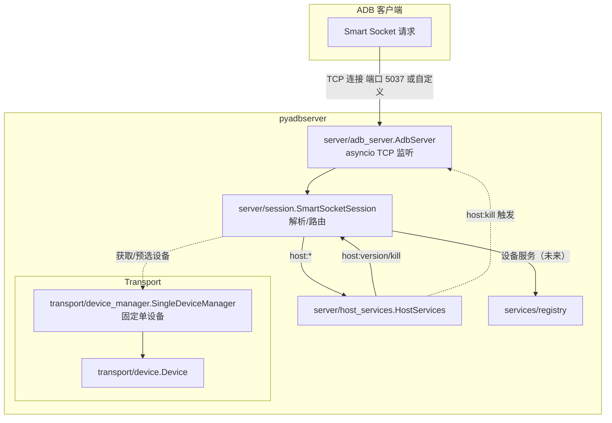

# pyadbserver

Python 实现的最小 ADB host 侧 smart-socket 服务器。M0 提供：
- `host:version`（返回文本版本号）
- `host:kill`（回复 OKAY 后优雅关闭）

本地运行（PowerShell 示例）：

```powershell
# 作为模块启动（读取 $env:ADB_SERVER_PORT 或使用 --port）
py -m pyadbserver --host 127.0.0.1 --port 5038

# 或运行仓库根的入口脚本
py -3 .\main.py

# 运行测试
uv run python -m unittest discover -s pyadbserver/tests -p 'test_*.py' -v
```

或直接运行某个测试：

```powershell
uv run python -m unittest tests.test_m0
```

### 模块与类交互示意



