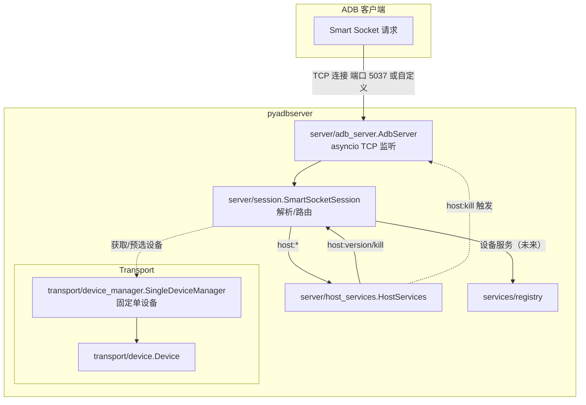

# pyadbserver

Python 实现的最小 ADB host 侧 smart-socket 服务器。M0 提供：
- `host:version`（返回文本版本号）
- `host:kill`（回复 OKAY 后优雅关闭）

本地运行（PowerShell 示例）：

```powershell
# 作为模块启动（读取 $env:ADB_SERVER_PORT 或使用 --port）
py -m pyadbserver --host 127.0.0.1 --port 5038

# 或运行仓库根的入口脚本
py -3 .\main.py

# 运行测试
uv run python -m unittest discover -s pyadbserver/tests -p 'test_*.py' -v
```

或直接运行某个测试：

```powershell
uv run python -m unittest tests.test_m0
```

### 模块与类交互示意




### 自定义 API（Flask 风格路由）

- **基本概念**
  - 使用 `App` 管理路由；`@route("pattern")` 装饰器为函数或类方法注册路由。
  - 路由模式按冒号分段，支持占位符 `<name>`，例如：`host-serial:<serial>:kill`。
  - 处理器返回 `OK()` 或 `OK(b"body")`、`FAIL("reason")`。返回 `None` 视为 `OK()`。
  - 当前会话 `session` 通过全局魔术变量 `g_session` 获取（无需作为参数传入）。

- **函数式路由**
```python
from pyadbserver.server import App, AdbServer, route, OK

app = App()

@app.route("host:ping")
async def ping():
    return OK(b"pong")

server = AdbServer(app=app)
await server.start()
```

- **类方法路由（带状态）**
```python
from pyadbserver.server import App, AdbServer, route, OK

app = App()

class MyAPI:
    def __init__(self, server: AdbServer) -> None:
        self._server = server

    @route("host:kill-soft")
    async def kill_soft(self):
        self._server.request_shutdown()
        return OK()

server = AdbServer(app=app)
app.register(MyAPI(server))
await server.start()
```

- **带参数的路由**
```python
from pyadbserver.server import App, AdbServer, OK

app = App()

@app.route("host-serial:<serial>:kill")
async def kill_by_serial(serial: str):
    # 根据 serial 进行处理
    return OK()

server = AdbServer(app=app)
await server.start()
```

- **访问当前会话**
```python
from pyadbserver.server import App, AdbServer, route, OK, g_session

app = App()

@app.route("host:whoami")
async def whoami():
    session = g_session.get()
    # 仅作示例：返回固定内容；你也可以基于 session 做更复杂逻辑
    return OK(b"server")

server = AdbServer(app=app)
await server.start()
```

- **默认路由与覆盖**
  - 内置 `host:version` 与 `host:kill`，由 `DefaultAPI` 提供。
  - 如需覆盖，推荐先创建并注册自己的 `App` 路由，再将该 `app` 传给 `AdbServer(app=app)`，你的路由会优先生效。
